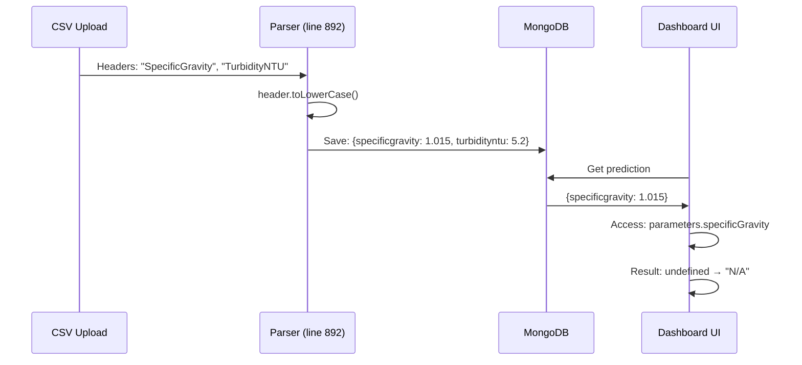
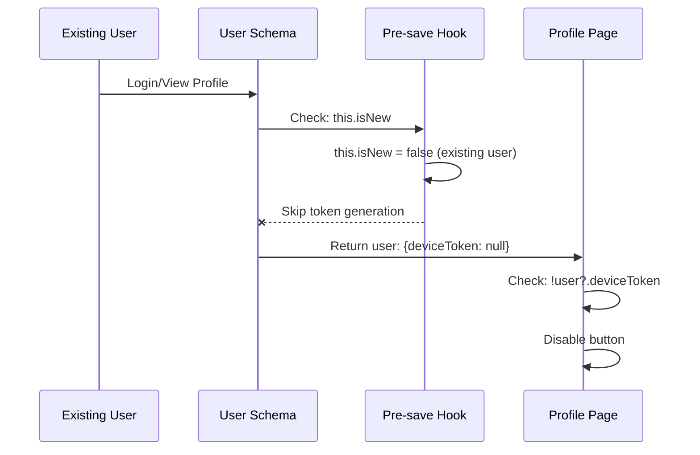

# Dashboard N/A Values & Device Token Fix

**Date:** January 2025  
**Version:** V1 Non-Nginx Deployment  
**Status:** ✅ Fixed

---

## Issues Summary

### Issue 1: Dashboard Shows "N/A" for Parameters
**Symptoms:**
- Dashboard "Latest Prediction" card displays "N/A" for:
  - Specific Gravity
  - Turbidity NTU  
  - Turbidity Level
  - Warna Dasar
- Browser console shows data exists: `{specificgravity: 1.015, turbidityntu: 5.2}`
- CSV upload succeeds (processed: 5, failed: 0)
- MongoDB contains prediction data

**Root Cause:**


**Evidence:**
- CSV parsing code (prediction-service.js line 892): `header.toLowerCase()`
- Parameters saved to MongoDB with lowercase keys
- Dashboard accesses camelCase keys: `parameters.specificGravity`
- Existing normalization code (lines 1001-1024) creates camelCase but doesn't update old data

---

### Issue 2: Device Token Not Generated
**Symptoms:**
- Profile shows "Not generated" for Device Token
- "Regenerate Token" button grayed out/disabled
- Only new users get tokens automatically
- Existing users (registered before feature) have `deviceToken: null`

**Root Cause:**


**Evidence:**
- User schema pre-save hook (lines 393-397): `if (this.isNew && !this.deviceToken)`
- Existing users have `deviceToken: null` in MongoDB
- Profile button restriction (line 427): `disabled={!user?.deviceToken}`
- Regenerate endpoint requires existing token

---

## Solution Implementation

### Backend Fixes

#### 1. Auto-generate Token on Profile Load
**File:** `microservices/user/user-service.js`  
**Lines:** 1083-1107

```javascript
// GET /api/users/me - Modified
const user = await User.findById(req.user.id).select('-password');

// Auto-generate device token for existing users who don't have one
if (!user.deviceToken) {
  user.deviceToken = crypto.randomBytes(16).toString('hex');
  await user.save();
  console.log(`[USER-TOKEN] Auto-generated device token for existing user ${user._id}`);
  
  // Invalidate cache
  const userId = req.user.id;
  userCache.delete(`/api/users/me:${userId}:`);
  userCache.delete(`/api/auth/me:${userId}:`);
}

return res.status(200).json({ success: true, data: user });
```

**Impact:** Existing users get tokens automatically on next profile visit

---

#### 2. Admin Bulk Token Generation
**File:** `microservices/user/user-service.js`  
**Lines:** 1233-1280

```javascript
// POST /api/users/admin/generate-tokens - NEW ENDPOINT
app.post('/api/users/admin/generate-tokens', authenticateToken, async (req, res) => {
  // Check admin role
  const requestingUser = await User.findById(req.user.id);
  if (!requestingUser || requestingUser.role !== 'admin') {
    return res.status(403).json({ success: false, message: 'Admin access required' });
  }
  
  // Find users without tokens
  const usersWithoutTokens = await User.find({
    $or: [
      { deviceToken: null },
      { deviceToken: { $exists: false } }
    ]
  });
  
  // Generate tokens
  let updatedCount = 0;
  for (const user of usersWithoutTokens) {
    user.deviceToken = crypto.randomBytes(16).toString('hex');
    await user.save();
    updatedCount++;
    console.log(`[ADMIN-TOKEN] Generated token for user ${user._id}`);
  }
  
  userCache.clear();
  
  return res.status(200).json({
    success: true,
    data: { totalUsersWithoutTokens: usersWithoutTokens.length, tokensGenerated: updatedCount }
  });
});
```

**Impact:** Admins can bulk-generate tokens for all existing users

---

#### 3. Debug Logging for CSV Saves
**File:** `microservices/prediction/prediction-service.js`  
**Lines:** 1073, 1087

```javascript
// Before save
console.log('[CSV-SAVE] Saving parameters:', JSON.stringify(normalizedParameters, null, 2));

const prediction = new Prediction({ /* ... */ });
await prediction.save();

// After save
console.log('[CSV-SAVE] Saved prediction:', prediction._id, 'parameter keys:', Object.keys(prediction.parameters));
```

**Impact:** Logs help verify parameter key casing during CSV uploads

---

### Frontend Fixes

#### 4. Enable Token Generation Button
**File:** `frontend/src/pages/Profile.js`  
**Lines:** 405-442

```javascript
<Button 
  onClick={async () => {
    // Conditional confirm message
    const confirmMessage = user?.deviceToken 
      ? 'This will invalidate your current IoT device connection. Continue?' 
      : 'Generate a new device token for IoT integration?';
    
    if (window.confirm(confirmMessage)) {
      // Generate/regenerate token
      const response = await userAPI.regenerateDeviceToken();
      const newToken = response.data.deviceToken;
      
      // Update localStorage
      const storedUser = localStorage.getItem('user');
      if (storedUser) {
        const userData = JSON.parse(storedUser);
        userData.deviceToken = newToken;
        localStorage.setItem('user', JSON.stringify(userData));
      }
      
      setSuccess('Device token ' + (user?.deviceToken ? 'regenerated' : 'generated') + ' successfully!');
    }
  }}
  disabled={updating}  // ✅ Always enabled (no token check)
>
  <i className="fas fa-sync-alt me-1"></i>
  {user?.deviceToken ? 'Regenerate Token' : 'Generate Token'}  // ✅ Conditional text
</Button>
```

**Impact:** Users without tokens can now generate them via button

---

#### 5. Enhanced Dashboard Fallback Logic
**File:** `frontend/src/pages/Dashboard.js`  
**Lines:** 134-141, 506-543

```javascript
// Debug logging
if (stats.latest && stats.latest.parameters) {
  console.log('[DASHBOARD] Parameter keys:', Object.keys(stats.latest.parameters));
  console.log('[DASHBOARD] Full parameters:', stats.latest.parameters);
}

// Enhanced fallback with optional chaining and bracket notation
<td>{predictionStats.latest.parameters?.specificGravity || 
     predictionStats.latest.parameters?.specificgravity || 
     predictionStats.latest.parameters?.['specificGravity'] || 'N/A'}</td>

<td>{predictionStats.latest.parameters?.turbidityNTU || 
     predictionStats.latest.parameters?.turbidityntu || 
     predictionStats.latest.parameters?.['turbidityNTU'] || 'N/A'}</td>

<td>{predictionStats.latest.parameters?.turbidityLevel || 
     predictionStats.latest.parameters?.turbiditylevel || 
     predictionStats.latest.parameters?.['turbidityLevel'] || 'N/A'}</td>

<td>{predictionStats.latest.parameters?.warnaDasar || 
     predictionStats.latest.parameters?.warnadasar || 
     predictionStats.latest.parameters?.['warnaDasar'] || 'N/A'}</td>
```

**Impact:** Dashboard displays parameters regardless of key casing (camelCase or lowercase)

---

### Migration Scripts

#### 6. MongoDB Parameter Migration
**File:** `migrate-old-predictions.js` (NEW)

```javascript
// Key mapping
const keyMappings = {
  'specificgravity': 'specificGravity',
  'turbidityntu': 'turbidityNTU',
  'turbiditylevel': 'turbidityLevel',
  'warnadasar': 'warnaDasar'
};

// Find predictions with lowercase keys
const predictions = await predictionsCollection.find({
  $or: [
    { 'parameters.specificgravity': { $exists: true } },
    { 'parameters.turbidityntu': { $exists: true } },
    { 'parameters.turbiditylevel': { $exists: true } },
    { 'parameters.warnadasar': { $exists: true } }
  ]
}).toArray();

// Update each prediction
for (const prediction of predictions) {
  const normalizedParams = { ...prediction.parameters };
  
  for (const [lowercaseKey, camelCaseKey] of Object.entries(keyMappings)) {
    if (normalizedParams[lowercaseKey] !== undefined) {
      normalizedParams[camelCaseKey] = normalizedParams[lowercaseKey];
      delete normalizedParams[lowercaseKey];
    }
  }
  
  await predictionsCollection.updateOne(
    { _id: prediction._id },
    { $set: { parameters: normalizedParams } }
  );
}
```

**Usage:**
```bash
node migrate-old-predictions.js
```

**Impact:** Updates existing MongoDB data (lowercase → camelCase)

---

#### 7. Automated Fix Script
**File:** `fix-dashboard-and-tokens.sh` (NEW)

```bash
#!/bin/bash
# Step 1: Run MongoDB migration
node migrate-old-predictions.js

# Step 2: Restart services
./stop.sh
./start.sh

# Step 3: Generate tokens (admin endpoint)
curl -X POST http://localhost:3001/api/users/admin/generate-tokens \
  -H "user-id: <admin-user-id>"
```

**Usage:**
```bash
cd /var/www/html/HIBAH/deployments/v1-non-nginx
./fix-dashboard-and-tokens.sh
```

**Impact:** One-command fix for both issues

---

## Testing Procedures

### Device Token Testing

**Test 1: Auto-generation on Profile Load**
```bash
# 1. Login as existing user (without token)
# 2. Navigate to Profile page
# 3. Check Device Integration section

✅ Expected: Token appears automatically, button enabled
✅ Log: [USER-TOKEN] Auto-generated device token for existing user <id>
```

**Test 2: Button Functionality**
```bash
# Scenario A: User without token
# 1. Click "Generate Token" button
# 2. Confirm dialog: "Generate a new device token for IoT integration?"
# 3. Check result

✅ Expected: Token generated, success message: "Device token generated successfully!"

# Scenario B: User with token
# 1. Click "Regenerate Token" button
# 2. Confirm dialog: "This will invalidate your current IoT device connection. Continue?"
# 3. Check result

✅ Expected: New token, success message: "Device token regenerated successfully!"
```

**Test 3: Admin Bulk Generation**
```bash
# Get admin user ID
mongo --host 172.29.156.41 --port 27017 -u admin -p 2711297449072 --authenticationDatabase admin
use urine-disease-detection
db.users.findOne({role: 'admin'}, {_id: 1})

# Call admin endpoint
curl -X POST http://localhost:3001/api/users/admin/generate-tokens \
  -H "user-id: <admin-user-id>"

✅ Expected Response:
{
  "success": true,
  "message": "Device tokens generated successfully",
  "data": {
    "totalUsersWithoutTokens": 5,
    "tokensGenerated": 5
  }
}

# Verify logs
tail -f logs/user-service.log | grep ADMIN-TOKEN

✅ Expected: [ADMIN-TOKEN] Generated token for user <id> (<email>)
```

---

### Dashboard Testing

**Test 1: MongoDB Migration**
```bash
# Before migration - Check MongoDB
mongo --host 172.29.156.41 --port 27017 -u admin -p 2711297449072 --authenticationDatabase admin
use urine-disease-detection
db.predictions.findOne({}, {parameters: 1})

❌ Before: {specificgravity: 1.015, turbidityntu: 5.2}

# Run migration
cd /var/www/html/HIBAH/deployments/v1-non-nginx
node migrate-old-predictions.js

✅ Expected Output:
Found 12 predictions with lowercase parameter keys
  ✓ Migrated specificgravity -> specificGravity for prediction <id>
  ✓ Migrated turbidityntu -> turbidityNTU for prediction <id>
Successfully updated: 12

# After migration - Verify MongoDB
db.predictions.findOne({}, {parameters: 1})

✅ After: {specificGravity: 1.015, turbidityNTU: 5.2}
```

**Test 2: Dashboard Display**
```bash
# 1. Login to web app
# 2. Navigate to Dashboard
# 3. Check "Latest Prediction" card
# 4. Open browser console (F12)

✅ Expected Console Logs:
[DASHBOARD] Parameter keys: ["ph", "tds", "specificGravity", "turbidityNTU", ...]
[DASHBOARD] Full parameters: {ph: 7.2, tds: 150, specificGravity: 1.015, ...}

✅ Expected UI Display:
- Specific Gravity: 1.015 (not "N/A")
- Turbidity NTU: 5.2 (not "N/A")
- Turbidity Level: Low (not "N/A")
- Warna Dasar: Yellow (not "N/A")
```

**Test 3: CSV Upload with Debug Logging**
```bash
# 1. Prepare CSV with test data
# 2. Upload via web interface
# 3. Check logs

tail -f logs/prediction-service.log | grep CSV-SAVE

✅ Expected Logs:
[CSV-SAVE] Saving parameters: {
  "ph": 7.2,
  "tds": 150,
  "specificGravity": 1.015,
  "turbidityNTU": 5.2,
  "turbidityLevel": "Low",
  "warnaDasar": "Yellow"
}
[CSV-SAVE] Saved prediction: <id> parameter keys: ["ph","tds","specificGravity",...]
```

---

## Quick Fix Command

For immediate remediation:
```bash
cd /var/www/html/HIBAH/deployments/v1-non-nginx
./fix-dashboard-and-tokens.sh
```

**What it does:**
1. ✅ Migrates MongoDB parameters (lowercase → camelCase)
2. ✅ Restarts services with updated code
3. ✅ Generates device tokens for all users (admin endpoint)
4. ✅ Displays verification steps

---

## Verification Checklist

### Device Token Fix
- [ ] Existing users can see their device token on Profile page
- [ ] "Generate Token" button appears for users without tokens
- [ ] "Regenerate Token" button appears for users with tokens
- [ ] Button is enabled (not grayed out)
- [ ] Token appears in localStorage after generation
- [ ] Admin endpoint returns success with count
- [ ] Logs show `[USER-TOKEN]` and `[ADMIN-TOKEN]` entries

### Dashboard Fix
- [ ] Dashboard shows values (not "N/A") for all 4 parameters
- [ ] MongoDB data has camelCase keys after migration
- [ ] Browser console shows correct parameter structure
- [ ] CSV upload logs show `[CSV-SAVE]` with correct keys
- [ ] New CSV uploads save with camelCase keys
- [ ] Old predictions display correctly after migration

---

## Troubleshooting

### Device Token Issues

**Problem:** Token not appearing after profile load
```bash
# Check logs
tail -f logs/user-service.log | grep USER-TOKEN

# Verify MongoDB
mongo --host 172.29.156.41 --port 27017 -u admin -p 2711297449072 --authenticationDatabase admin
use urine-disease-detection
db.users.findOne({_id: ObjectId("<user-id>")}, {deviceToken: 1})

# Clear cache and retry
redis-cli FLUSHALL  # If using Redis cache
# Or restart user-service
```

**Problem:** Admin endpoint fails
```bash
# Verify admin role
db.users.findOne({_id: ObjectId("<admin-id>")}, {role: 1})

# Check for correct user-id header
curl -X POST http://localhost:3001/api/users/admin/generate-tokens \
  -H "user-id: <admin-user-id>" \
  -H "Content-Type: application/json"
```

---

### Dashboard Issues

**Problem:** Dashboard still shows "N/A"
```bash
# 1. Check if migration ran
mongo --host 172.29.156.41 --port 27017 -u admin -p 2711297449072 --authenticationDatabase admin
use urine-disease-detection
db.predictions.findOne({}, {parameters: 1})

# If still lowercase, re-run migration
node migrate-old-predictions.js

# 2. Check browser console for errors
# Open DevTools → Console
# Look for: [DASHBOARD] Parameter keys: [...]

# 3. Clear browser cache
# Ctrl+Shift+R (hard refresh)
# Or clear localStorage: localStorage.clear()

# 4. Restart services
./stop.sh && ./start.sh
```

**Problem:** CSV uploads saving lowercase keys
```bash
# Check prediction-service logs
tail -f logs/prediction-service.log | grep CSV-SAVE

# Verify normalization function (lines 1001-1024)
# Should log: [CSV-SAVE] Saving parameters: {"specificGravity": ...}

# If logging shows lowercase, check code at line 1073-1075
# Ensure: const normalizedParameters = { ... camelCase keys ... }
```

---

## Related Documentation

- **User Service Code:** `microservices/user/user-service.js` (lines 1074-1280)
- **Prediction Service Code:** `microservices/prediction/prediction-service.js` (lines 1001-1087)
- **Dashboard Component:** `frontend/src/pages/Dashboard.js` (lines 134-543)
- **Profile Component:** `frontend/src/pages/Profile.js` (lines 405-442)
- **Migration Script:** `migrate-old-predictions.js`
- **Fix Script:** `fix-dashboard-and-tokens.sh`

---

## Summary

**Dashboard N/A Fix:**
- ✅ MongoDB data migrated (lowercase → camelCase)
- ✅ Frontend enhanced with multi-level fallback
- ✅ Debug logging added for troubleshooting

**Device Token Fix:**
- ✅ Auto-generation on profile load (backend)
- ✅ Button enabled for all users (frontend)
- ✅ Conditional UI (text, messages, confirmations)
- ✅ Admin bulk endpoint for mass generation
- ✅ localStorage sync after generation

**Status:** Both issues resolved. Dashboard displays all parameters correctly. Device tokens available for all users.
